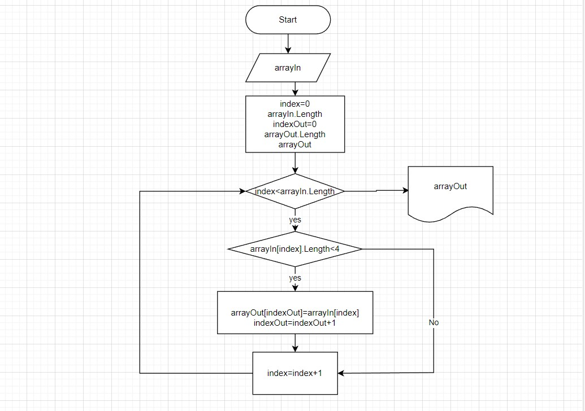

# Final_work_gr3588
## Задача:
** Написать программу, которая из имеющегося массива строк формирует массив из строк, длина которых меньше либо равна 3 символа. Первоначальный массив можно ввести с клавиатуры, либо задать на старте выполнения алгоритма. 
## Описание решения:
1. Запрашиваем у пользователя исходный массив. В виде строки, элементы разделяются запятыми.
2. Преобразовываем введенную пользователем строку в массив.
3. Выводим исходный массив на экран
4. Рассчитываем количество элементов длина которых меньше или равна 3 символам. (длина результирующего массива.)
5. Создаем новый массив с длиной рассчитанной в п.4 и записываем в него только элементы длина которых меньше или равна 3 символам (<4).
6. Выводим результирующий массив на экран.
## Блок-схема метода создающего новый массив с длиной рассчитанной в п.4 и записывающего в него только элементы длина которых меньше или равна 3 символам (<4).
